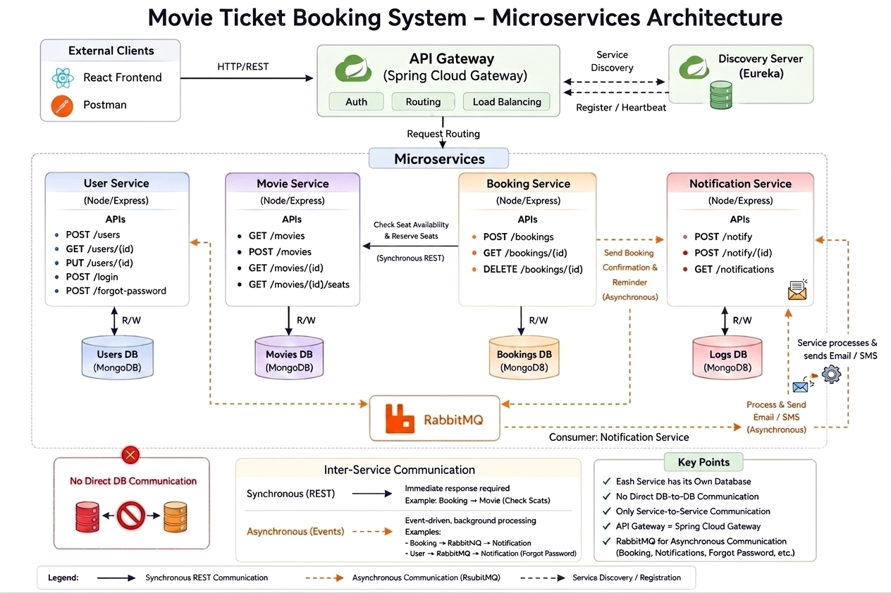

# Movie Ticket Booking System — Microservices

> A distributed movie ticket booking platform built with a microservices architecture using the Netflix OSS stack, Spring Cloud Gateway, RabbitMQ, and React.

---

## Table of Contents

1. [Introduction](#1-introduction)
2. [Architecture](#2-architecture)
3. [Microservices](#3-microservices)
   - [User Service](#user-service)
   - [Movie Service](#movie-service)
   - [Booking Service](#booking-service)
   - [Notification Service](#notification-service)
   - [Discovery Server](#discovery-server-eureka)
   - [API Gateway](#api-gateway)
4. [User Interface](#4-user-interface)
5. [Deployment](#5-deployment)
6. [Source Code](#6-source-code)
7. [Development Challenges](#7-development-challenges)
8. [References](#8-references)

---

## 1. Introduction

The **Movie Ticket Booking System** is a full-stack distributed application that allows users to browse movies, select seats, and make bookings online. The system is designed using a **microservices architecture**, where each business capability is isolated into its own independently deployable service.

### Core Features

- **User Authentication** - Secure registration, login, and profile management with JWT-based authentication
- **Movie Catalog** - Browse available movies and view real-time seat availability
- **Seat Booking** - Reserve specific seats for a movie; prevent double-booking via atomic seat locking
- **Booking Management** - View booking history and cancel existing bookings
- **Notifications** - Automated notifcations for registration, booking confirmation, cancellation, and password resets
- **Rate Limiting** - Protects authentication endpoints from brute-force attacks using Redis
- **Load Balancing** - Multiple instances of any service can be scaled horizontally with automatic round-robin distribution

### Overall Goal

The goal is to demonstrate how a monolithic booking application can be decomposed into loosely coupled services that communicate via well-defined interfaces - using synchronous REST calls for operations requiring immediate responses and asynchronous message queues for event-driven notifications.

---

## 2. Architecture

### Architectural Diagram




### Service Table

| Service | Technology | Port | Purpose |
|---|---|---|---|
| `frontend` | React + Vite | 5173 | User interface |
| `api-gateway` | Spring Cloud Gateway | 8080 | Single entry point, JWT validation, routing, load balancing |
| `eureka-server` | Spring Cloud Netflix Eureka | 8761 | Service registry and discovery |
| `user-service` | Node.js / Express | 5000 | Authentication, user profiles |
| `movie-service` | Node.js / Express | 5002 (internal) | Movie catalog, seat management |
| `booking-service` | Node.js / Express | 5003 | Booking lifecycle management |
| `notification-service` | Node.js / Express | 5001 | Email notifications (RabbitMQ consumer) |
| `mongo` | MongoDB 7 | 27017 | Persistent data store (one DB per service) |
| `rabbitmq` | RabbitMQ 3 | 5672 / 15672 | Async event messaging |
| `redis` | Redis 7 | 6379 | Rate limiting |

### Design Decisions

**Why split into these specific services?**

| Decision | Reasoning |
|---|---|
| **User Service isolated** | Authentication and identity are a separate concern that other services consume (via JWT), not by calling the user service directly |
| **Movie Service isolated** | Movie catalog and seat state are independently manageable; movie-service owns the source of truth for seat availability |
| **Booking Service isolated** | Booking lifecycle (create, cancel) coordinates between the user context (JWT) and seat state (movie-service), making it a natural orchestrator |
| **Notification Service isolated** | Email delivery is a side-effect, not part of core business logic. Decoupling it via RabbitMQ means a failed email never blocks a booking |
| **Synchronous call only for seat operations** | Reserving and releasing seats must succeed or fail atomically before the booking is saved - a queue would allow inconsistency |
| **Asynchronous messaging for all notifications** | Emails are eventual - users tolerate a few seconds' delay, and the system should not fail a booking if the mail server is slow |

---

## 3. Microservices

### Implementation Methods - Netflix Software Stack

The system uses the **Netflix OSS** components integrated via Spring Cloud:

| Netflix Component | Spring Cloud Wrapper | Role in This System |
|---|---|---|
| **Netflix Eureka** | `spring-cloud-starter-netflix-eureka-server` / `-client` | Service registry - all services register and discover each other |
| **Netflix Ribbon** (superseded) | `spring-cloud-loadbalancer` | Round-robin load balancing at the gateway |
| **Spring Cloud Gateway** | `spring-cloud-starter-gateway` | API gateway replacing Netflix Zuul |

Node.js services use the **`eureka-js-client`** npm package to register with and send heartbeats to the Eureka server.

---

### User Service

**Technology:** Node.js, Express, MongoDB, Redis, RabbitMQ  
**Port:** 5000  
**Database:** `user-service-db`

#### Functionality
Handles all user identity concerns - registration, login, profile retrieval and update, and password reset. Issues JWTs that are verified by both the API Gateway and downstream services. Uses Redis-backed rate limiting on sensitive endpoints to prevent brute-force attacks.

#### REST API Endpoints

| Method | Endpoint | Auth | Description |
|---|---|---|---|
| `POST` | `/api/users/register` | Public | Register a new user; triggers welcome email via RabbitMQ |
| `POST` | `/api/users/login` | Public | Authenticate and receive a JWT |
| `GET` | `/api/users/getuser/:id` | Protected (JWT) | Fetch a user's profile by ID |
| `PUT` | `/api/users/updateuser/:id` | Protected (JWT) | Update name, email, or password; triggers profile-updated email |
| `POST` | `/api/users/forgot-password` | Public | Generate a reset token and send reset email via RabbitMQ |

#### Inter-Service Interactions

- **→ RabbitMQ `user_events_queue`** - Publishes `USER_REGISTERED` and `PROFILE_UPDATED` events after successful operations
- **→ RabbitMQ `forgot_passwordemail_queue`** - Publishes `FORGOT_PASSWORD` event containing a hashed reset token
- **→ Redis** - Rate limiter middleware queries Redis before processing login/register/forgot-password requests
- No direct HTTP calls to other services

---

### Movie Service

**Technology:** Node.js, Express, MongoDB, RabbitMQ  
**Port:** 5002 (internal - not exposed on host; reachable only via gateway)  
**Database:** `movie-service-db`

#### Functionality
Owns the movie catalog and seat inventory. Provides CRUD operations for movies and handles seat reservation/release atomically in MongoDB. Publishes lifecycle events to RabbitMQ when movies are created, updated, or deleted.

#### REST API Endpoints

| Method | Endpoint | Auth | Description |
|---|---|---|---|
| `GET` | `/api/movies/get-movies` | Public | List all movies |
| `GET` | `/api/movies/get-movie/:id` | Public | Get a single movie by ID |
| `POST` | `/api/movies/create-movie` | Protected (JWT) | Create a new movie |
| `PUT` | `/api/movies/update-movie/:id` | Protected (JWT) | Update movie details |
| `DELETE` | `/api/movies/delete-movie/:id` | Protected (JWT) | Delete a movie |
| `POST` | `/api/movies/reserve-seats` | Internal | Mark seats as booked (called by booking-service) |
| `POST` | `/api/movies/release-seats` | Internal | Unmark seats (called by booking-service on cancel) |
| `GET` | `/api/movies/available-seats/:id` | Public | Get list of available (unbooked) seats |
| `POST` | `/api/movies/select-movie` | Protected (JWT) | Publish a `MOVIE_SELECTED` fanout event to RabbitMQ |

#### Inter-Service Interactions

- **← booking-service (SYNC HTTP)** - Receives `POST /reserve-seats` and `POST /release-seats` calls from booking-service synchronously
- **→ RabbitMQ `movie_events_queue`** - Publishes `MOVIE_CREATED`, `MOVIE_UPDATED`, `MOVIE_DELETED` events
- **→ RabbitMQ `movie_exchange` (fanout)** - Publishes `MOVIE_SELECTED` events broadcast to all bound queues

---

### Booking Service

**Technology:** Node.js, Express, MongoDB, RabbitMQ  
**Port:** 5003  
**Database:** `booking-service-db`

#### Functionality
Manages the full booking lifecycle. When creating a booking, it first calls movie-service synchronously to reserve the seat - if that fails, the booking is not created. On cancellation, it calls movie-service to release the seat before updating the booking record. Publishes confirmation and cancellation events to RabbitMQ for email notifications.

#### REST API Endpoints

| Method | Endpoint | Auth | Description |
|---|---|---|---|
| `POST` | `/api/bookings` | Protected (JWT) | Create a new booking; calls movie-service to reserve seat |
| `GET` | `/api/bookings/my` | Protected (JWT) | Get all bookings for the logged-in user |
| `GET` | `/api/bookings/:id` | Protected (JWT) | Get a single booking by ID (owner only) |
| `DELETE` | `/api/bookings/:id` | Protected (JWT) | Cancel a booking; calls movie-service to release seat |

#### Inter-Service Interactions

- **→ movie-service `POST /api/movies/reserve-seats` (SYNC HTTP)** - Blocks until movie-service confirms seat reservation; returns 503 if movie-service is unreachable
- **→ movie-service `POST /api/movies/release-seats` (SYNC HTTP)** - Blocks until seat is released; cancellation is blocked if movie-service is down
- **→ RabbitMQ `booking_confirmation_queue`** - Publishes `BOOKING_CONFIRMED` event after successful booking
- **→ RabbitMQ `booking_cancelled_queue`** - Publishes `BOOKING_CANCELLED` event after successful cancellation

---

### Notification Service

**Technology:** Node.js, Express, MongoDB, RabbitMQ, Nodemailer  
**Port:** 5001  
**Database:** `notification-service-db`

#### Functionality
A pure consumer service - it exposes no HTTP business endpoints. On startup it connects to RabbitMQ and subscribes to all event queues. When a message arrives, it renders the appropriate HTML email template and sends it via Gmail SMTP using Nodemailer. Acknowledges each message only after successful delivery; failed deliveries are negatively acknowledged and discarded.

#### Queues Consumed

| Queue | Event Type | Email Sent |
|---|---|---|
| `user_events_queue` | `USER_REGISTERED` | Welcome email |
| `user_events_queue` | `PROFILE_UPDATED` | Profile update confirmation |
| `forgot_passwordemail_queue` | `FORGOT_PASSWORD` | Password reset link |
| `booking_confirmation_queue` | `BOOKING_CONFIRMED` | Booking confirmation with details |
| `booking_cancelled_queue` | `BOOKING_CANCELLED` | Cancellation confirmation |
| `movie_events_queue` | `MOVIE_CREATED` / `MOVIE_UPDATED` / `MOVIE_DELETED` | Internal logging |
| `movie_selection_events_queue` | `MOVIE_SELECTED` (via fanout exchange) | Internal logging |

#### Inter-Service Interactions

- **← RabbitMQ (ASYNC)** - Consumes all queues listed above; no outbound HTTP calls to other services
- **→ Gmail SMTP** - Sends emails using Nodemailer with credentials from environment variables

---

### Discovery Server (Eureka)

**Technology:** Spring Boot, Spring Cloud Netflix Eureka Server  
**Port:** 8761

#### How Services Register

Every Node.js service uses `eureka-js-client` to self-register on startup:

```js
// Each service calls this after the HTTP server starts listening:
eurekaClient.start((error) => {
  if (error) console.log("Eureka registration failed:", error);
  else console.log("Service registered in Eureka");
});
```

The registration payload includes:
- `app` - service name (e.g., `BOOKING-SERVICE`)
- `ipAddr` / `hostName` - the container's own IP, auto-detected at runtime
- `port` - the service's listening port
- `vipAddress` - lowercase alias used by the gateway for routing

#### How the Server Monitors Services

Services send **periodic heartbeats** to Eureka to renew their lease:

```yaml
# Per service (docker-compose.yml env vars):
EUREKA_LEASE_RENEWAL_INTERVAL: 5      # heartbeat every 5 seconds
EUREKA_LEASE_EXPIRATION_DURATION: 10  # expire if no heartbeat for 10 seconds
EUREKA_HEARTBEAT_INTERVAL: 5000       # ms between heartbeats (eureka-js-client)

# Eureka server (application.yml):
eureka:
  server:
    eviction-interval-timer-in-ms: 5000  # sweep dead instances every 5 seconds
```

If a service crashes or stops sending heartbeats, Eureka marks it as expired and removes it from the registry within ~10 seconds. The API Gateway refreshes its local copy of the registry every 5 seconds, so dead instances stop receiving traffic quickly.

#### Eureka Dashboard

Available at `http://localhost:8761` - shows all registered instances and their status (`UP` / `DOWN`).

---

### API Gateway

**Technology:** Spring Boot, Spring Cloud Gateway, Spring Cloud LoadBalancer  
**Port:** 8080

#### Role in the System

The API Gateway is the **single entry point** for all client traffic. The frontend only ever speaks to `localhost:8080` - it has no knowledge of individual service ports.

#### Key Configurations (`application.yml`)

**1. Service Discovery-Based Routing**
```yaml
spring:
  cloud:
    gateway:
      discovery:
        locator:
          enabled: true
          lower-case-service-id: true
```
Routes are auto-generated from the Eureka registry. A request to `/user-service/api/users/login` is automatically proxied to whichever instance of `USER-SERVICE` is registered.

**2. JWT Authentication Filter (applied globally)**
```yaml
default-filters:
  - JwtAuthenticationFilter
```
Every request passes through `JwtAuthenticationFilter` before being forwarded. Public endpoints (login, register, get-movies, available-seats) are whitelisted and bypass validation. All others require a valid `Bearer` token.

**3. CORS Configuration**
```yaml
globalcors:
  cors-configurations:
    '[/**]':
      allowedOrigins:
        - "http://localhost:5173"
      allowedMethods: [GET, POST, PUT, DELETE, PATCH, OPTIONS]
      allowedHeaders: ["*"]
      allowCredentials: true
```
Only the React frontend origin is permitted. OPTIONS preflight requests are passed through without JWT validation.

**4. Load Balancing**

The gateway maintains a local cached copy of the Eureka registry (refreshed every 5 seconds). When multiple instances of a service are registered, Spring Cloud LoadBalancer distributes requests using **Round Robin** - each incoming request is forwarded to the next available instance in sequence.

```bash
# Scale movie-service to 3 replicas:
docker compose up -d --scale movie-service=3
# The gateway automatically routes across all 3 instances
```

**5. Registry Fetch Interval**
```yaml
eureka:
  client:
    registry-fetch-interval-seconds: 5
```
The gateway refreshes its local registry cache every 5 seconds, ensuring it quickly detects newly added or removed instances.

---

## 4. User Interface

### Implementation Details

The frontend is built with **React** and **Vite**, providing a fast development experience with hot module replacement (HMR).

| Tool / Library | Purpose |
|---|---|
| React 18 | Component-based UI framework |
| Vite | Build tool and dev server |
| React Router | Client-side navigation between pages |
| Axios / Fetch | HTTP requests to the API Gateway |
| CSS / Tailwind | Styling and responsive layout |

All API calls are directed to `http://localhost:8080` (the API Gateway). The JWT token received after login is stored in `localStorage` and attached as an `Authorization: Bearer <token>` header on every protected request.

### API Testing with Postman

All service endpoints were tested using **Postman** before and during frontend integration:

- **Collections** were created for each service (User, Movie, Booking) with environment variables for `baseUrl` (`http://localhost:8080`) and `token`
- **Authentication flow** - Login request saves the returned JWT to the Postman environment variable `{{token}}`, which is automatically injected into subsequent protected requests
- **Negative testing** - Endpoints were tested with missing tokens, expired tokens, invalid seat numbers, and duplicate booking attempts to validate error handling
- **Seed scripts** - `scripts/seedMoviesApi.js` was used alongside Postman to verify the `create-movie` endpoint under load

---

## 5. Deployment

### Prerequisites

- Docker Desktop with Docker Compose v2 (no local Node.js or Java installation required)

### Local Deployment (Docker Compose)

**Step 1 — Clone the repository**
```bash
git clone <repo-url>
cd Booking-System-Micro-Service-Mini-Project
```

**Step 2 — Create required `.env` files**

`movie-service/.env`:
```env
MONGODB_URL="mongodb://localhost:27017/movie-service-db"
JWT_SECRET=etwddsabdtw122442@jhjsagdyqudwjdgdw123456
PORT=5002
```

`booking-service/.env`:
```env
MONGODB_URL="mongodb://localhost:27017/booking-service-db"
JWT_SECRET=etwddsabdtw122442@jhjsagdyqudwjdgdw123456
PORT=5003
MOVIE_SERVICE_URL=http://localhost:5002
```

**Step 3 — Build and start all services**
```bash
docker compose up -d --build
```

**Step 4 - Verify all services are up**
```bash
docker compose ps
```
Open `http://localhost:8761` - confirm all 5 services (`USER-SERVICE`, `MOVIE-SERVICE`, `BOOKING-SERVICE`, `NOTIFICATION-SERVICE`, `API-GATEWAY`) show status `UP`.

**Step 5 - Seed the movie database**
```bash
docker compose exec movie-service node scripts/seedMovies.js
```

**Step 6 - Access the application**

| URL | Purpose |
|---|---|
| `http://localhost:5173` | React frontend |
| `http://localhost:8080` | API Gateway |
| `http://localhost:8761` | Eureka Dashboard |
| `http://localhost:15672` | RabbitMQ Management UI (guest/guest) |

### Cloud Deployment (Suggested)

For production deployment on a cloud provider (e.g., AWS, GCP, Azure):

1. **Containerise** - Each service already has a `Dockerfile`. Push all images to a container registry (Docker Hub / AWS ECR / GCP Artifact Registry)

2. **Orchestrate with Kubernetes** - Convert `docker-compose.yml` to Kubernetes manifests using `kompose convert`. Deploy to a managed Kubernetes cluster (EKS, GKE, AKS)
   ```bash
   kompose convert -f docker-compose.yml
   kubectl apply -f .
   ```

3. **Managed Services** - Replace self-hosted infrastructure with managed equivalents:
   - MongoDB → **MongoDB Atlas** or AWS DocumentDB
   - RabbitMQ → **Amazon MQ** or CloudAMQP
   - Redis → **AWS ElastiCache** or Redis Cloud

4. **Ingress** - Replace the API Gateway's localhost CORS origin with the production domain. Use an Ingress controller (NGINX) in front of the gateway

5. **Secrets Management** - Move all `.env` secrets to **Kubernetes Secrets** or **AWS Secrets Manager** instead of committed files

### Useful Commands

```bash
# Tail logs for a service
docker compose logs -f booking-service

# Rebuild and restart a single service after code changes
docker compose up -d --build movie-service

# Scale movie-service to 3 replicas for load balancing
docker compose up -d --scale movie-service=3

# Stop everything (data preserved)
docker compose down

# Stop everything and wipe database volumes
docker compose down -v

# Restart services that failed to register with Eureka on first start
docker compose restart user-service movie-service booking-service nodification-service
```

---

## 6. Source Code

**GitHub Repository:** [https://github.com/Remiltan123/Booking-System-Micro-Service-Mini-Project](https://github.com/Remiltan123/Booking-System-Micro-Service-Mini-Project)

### Repository Structure

```
Booking-System-Micro-Service-Mini-Project/
├── api-getway/               # Spring Cloud Gateway
├── eureka-server/            # Netflix Eureka Server
├── user-service/             # Node.js auth service
├── movie-service/            # Node.js movie catalog service
├── booking-service/          # Node.js booking service
├── nodification-service/     # Node.js email notification service
├── frontend/                 # React + Vite UI
└── docker-compose.yml        # Full stack orchestration
```

---

## 7. Development Challenges

### 1. Eureka Registration Race Condition
**Problem:** Node.js services started faster than the Spring Boot Eureka server, causing `ECONNREFUSED :8761` errors and failed registrations.  
**Solution:** Added `depends_on: eureka-server: condition: service_started` in `docker-compose.yml`, and documented a manual `docker compose restart` command for cases where the timing was still too tight.

### 2. Seat Double-Booking Race Condition
**Problem:** Two concurrent booking requests for the same seat could both pass the local DB check and both call `reserve-seats` on movie-service.  
**Solution:** The `reserve-seats` endpoint in movie-service checks `seat.isBooked` atomically before marking it - the second request receives a 400 response, and booking-service propagates that error to the client.

### 3. Scaling Conflicts with Fixed Host Ports
**Problem:** When trying to scale `movie-service` to multiple replicas, Docker rejected the second container because a fixed host port (`5002:5002`) was already claimed.  
**Solution:** Removed the host port mapping from `movie-service` in `docker-compose.yml`, making it reachable only through the gateway. This is the correct pattern for horizontally scaled services.

### 4. RabbitMQ Connection Timing
**Problem:** Services attempted to connect to RabbitMQ before it was fully ready, causing startup crashes.  
**Solution:** Added `healthcheck` for RabbitMQ in `docker-compose.yml` with `condition: service_healthy` on dependent services, ensuring RabbitMQ is fully accepting connections before services start.

### 5. CORS Preflight Blocking JWT Filter
**Problem:** Browser OPTIONS preflight requests were being intercepted by the `JwtAuthenticationFilter` and rejected with 401 because they carry no Authorization header.  
**Solution:** Added an explicit check at the top of the filter to pass OPTIONS requests through without validation, alongside the gateway-level CORS configuration.

---

## 8. References

- [Spring Cloud Gateway Documentation](https://docs.spring.io/spring-cloud-gateway/docs/current/reference/html/)
- [Spring Cloud Netflix Eureka Documentation](https://docs.spring.io/spring-cloud-netflix/docs/current/reference/html/)
- [eureka-js-client npm package](https://www.npmjs.com/package/eureka-js-client)
- [amqplib - RabbitMQ Node.js client](https://www.npmjs.com/package/amqplib)
- [RabbitMQ Documentation - Queues and Exchanges](https://www.rabbitmq.com/tutorials)
- [JSON Web Tokens (JWT) - jwt.io](https://jwt.io/introduction)
- [JJWT Library (Java JWT)](https://github.com/jwtk/jjwt)
- [Docker Compose Documentation](https://docs.docker.com/compose/)
- [Kompose - Docker Compose to Kubernetes](https://kompose.io/)
- [MongoDB Documentation](https://www.mongodb.com/docs/)
- [Redis Documentation](https://redis.io/docs/)
- [React Documentation](https://react.dev/)
- [Vite Documentation](https://vitejs.dev/)
